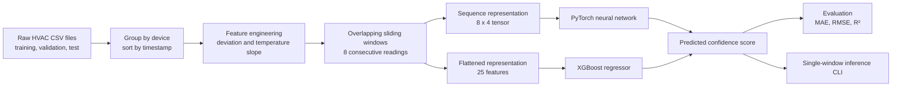

# HavenIQ HVAC Confidence Model: Codebase Overview

## Purpose

HavenIQ HVAC Confidence Model is a machine-learning pipeline for predicting an HVAC `confidence_score` from recent sensor telemetry.

The system converts raw per-device temperature readings into short chronological windows, engineers features that describe comfort deviation and temperature movement, and trains two regression models:

- an XGBoost regressor for a strong, interpretable tabular baseline
- a PyTorch neural network for learning nonlinear patterns across the full telemetry window

The project is designed as the predictive layer for a broader HVAC monitoring system. It estimates how concerning the current operating pattern is from the latest sequence of readings rather than evaluating each reading in isolation.

This document is intended to provide enough context to describe the project accurately in a portfolio website, project page, resume, or technical discussion.

## Portfolio Summary

Built a dual-model HVAC telemetry regression pipeline using Python, XGBoost, and PyTorch. The preprocessing workflow groups readings by device, sorts them chronologically, engineers temperature-deviation and slope features, and converts the data into overlapping 8-reading windows. The XGBoost model achieved an `R²` of `0.949` and an average absolute error of `4.576` points on a held-out test set. A PyTorch neural network provides a second learned baseline for model comparison and single-window inference.

## Resume Bullet

Built an HVAC telemetry regression pipeline using XGBoost and PyTorch, engineering sliding-window temperature features across 12,709 training readings and achieving an `R²` of `0.949` with a `4.576`-point MAE on a held-out test set.

## Verified Project Metrics

| Metric | Value |
| --- | --- |
| Raw training telemetry readings | 12,709 |
| Raw validation telemetry readings | 2,062 |
| Raw test telemetry readings | 1,996 |
| Training devices | 350 |
| Validation devices | 55 |
| Test devices | 55 |
| Readings per sliding window | 8 |
| Neural-network features per reading | 4 |
| Neural-network input shape | `[8, 4]` |
| Processed training windows | 9,909 |
| XGBoost features per window | 25 |
| XGBoost test MAE | `4.576` |
| XGBoost test RMSE | `5.929` |
| XGBoost test R² | `0.949` |

## High-Level Architecture



## Runtime Flow

The core workflow is:

```text
raw telemetry CSV
-> sort readings chronologically within each HVAC device
-> calculate engineered features
-> create overlapping 8-reading windows
-> train XGBoost and PyTorch regressors
-> evaluate both models on held-out telemetry
-> load either model for single-window prediction
```

Each prediction is aligned with the last timestep in its window. In practical terms, the system uses the latest 8 readings to predict the confidence score associated with the current HVAC state.

## Data Splits

The repository uses separate raw CSV files:

| File | Purpose | Rows | Devices |
| --- | --- | ---: | ---: |
| `data/raw/haveniq_hvac_training.csv` | Model training | 12,709 | 350 |
| `data/raw/haveniq_hvac_validation.csv` | Model selection and tuning | 2,062 | 55 |
| `data/raw/haveniq_hvac_test.csv` | Final held-out evaluation | 1,996 | 55 |

Keeping test telemetry separate from training data is important because adjacent sliding windows overlap. Evaluating on a separately held-out CSV avoids overstating performance through train/test leakage between nearly identical neighboring windows.

## Sliding-Window Pipeline

The window size is:

```python
W = 8
```

For each HVAC device, the preprocessing script creates overlapping windows with a stride of 1:

```text
readings 0 through 7
readings 1 through 8
readings 2 through 9
...
```

The system does not combine readings from different devices. It groups rows by `device_id`, sorts by `timestamp_utc`, and creates windows independently for each device.

## Feature Engineering

The neural-network representation contains 4 features per timestep:

| Feature | Meaning |
| --- | --- |
| `temp_c` | Current measured temperature |
| `setpoint_c` | Desired temperature |
| `deviation` | Signed error: `temp_c - setpoint_c` |
| `slope` | Temperature change since the previous reading |

The signed deviation preserves direction:

```text
positive deviation -> temperature is above the setpoint
negative deviation -> temperature is below the setpoint
```

The slope captures whether the measured temperature is rising or falling. Together, deviation and slope help the models distinguish a stable room from a room that is actively drifting away from its target.

The first reading for each device does not have a previous value, so it cannot have a valid slope. Those rows are dropped before windows are generated.

## Model Inputs

### PyTorch Neural Network

The neural network receives an 8-by-4 sequence:

```text
[8 timesteps, 4 features]
```

Example:

```text
[
  [temp_c, setpoint_c, deviation, slope],
  [temp_c, setpoint_c, deviation, slope],
  ...
]
```

The PyTorch model flattens the short chronological sequence and passes it through fully connected layers with ReLU activations:

```text
Flatten
-> Linear(32, 64)
-> ReLU
-> Linear(64, 32)
-> ReLU
-> Linear(32, 1)
```

The final layer outputs one continuous `confidence_score`.

### XGBoost Regressor

The XGBoost model uses a compact 25-feature representation:

```text
8 * [temp_c, deviation, slope] + 1 * [setpoint_c]
= 8 * 3 + 1
= 25 features
```

`setpoint_c` is appended once per window because it is constant within a window. Repeating it 8 times would add redundant values without additional information.

The regressor uses:

```python
XGBRegressor(
    n_estimators=300,
    max_depth=4,
    learning_rate=0.05,
    subsample=0.8,
    colsample_bytree=0.8,
    objective="reg:squarederror",
    random_state=42,
)
```

The training script also plots feature importance using:

- split count (`weight`)
- average loss reduction (`gain`)

## Evaluation Metrics

The evaluation workflow reports three standard regression metrics:

| Metric | Meaning |
| --- | --- |
| MAE | Average absolute difference between the predicted and actual score |
| RMSE | Similar to MAE, but penalizes large errors more heavily |
| R² | Proportion of score variation explained by the model |

The verified XGBoost held-out test results are:

```text
MAE:  4.576
RMSE: 5.929
R²:   0.949
```

The clearest portfolio interpretation is:

```text
The XGBoost model explained 94.9% of the variation in held-out HVAC
confidence scores and predicted scores with an average absolute error
of 4.576 points.
```

Avoid describing `R² = 0.949` as "95% accuracy." Accuracy is normally a classification metric, while this project predicts a continuous score.

## Repository Layout

```text
.
|-- data/
|   |-- raw/
|   |   |-- haveniq_hvac_training.csv
|   |   |-- haveniq_hvac_validation.csv
|   |   `-- haveniq_hvac_test.csv
|   `-- processed/
|       |-- windows_w8.npz
|       `-- windows_w8_xgb.npz
|-- models/
|   |-- xgboost/
|   |   `-- hvac_regressor.json
|   `-- neural_net/
|       `-- hvac_regressor.pt
|-- src/
|   |-- build_windows.py
|   |-- train_xgboost.py
|   |-- train_neural_net.py
|   |-- evaluate.py
|   `-- predict.py
|-- requirements.txt
|-- README.md
`-- CODEBASE.md
```

## Core Files

### `src/build_windows.py`

Builds training tensors from the raw CSV files.

Responsibilities:

- parse timestamps
- sort readings by device and timestamp
- calculate signed temperature deviation
- calculate per-device temperature slope
- drop rows without a valid prior reading
- build overlapping 8-reading windows
- save neural-network and XGBoost `.npz` datasets

Generated outputs:

```text
data/processed/windows_w8.npz
  X_seq: (9909, 8, 4)
  y:     (9909,)

data/processed/windows_w8_xgb.npz
  X_flat: (9909, 25)
  y:      (9909,)
```

### `src/train_xgboost.py`

Trains the XGBoost regressor, saves it in native JSON format, evaluates it on held-out test telemetry, and plots feature importance.

Generated model:

```text
models/xgboost/hvac_regressor.json
```

### `src/train_neural_net.py`

Loads the sequence dataset, creates reproducible training and validation splits, trains the PyTorch MLP regressor, and saves its learned weights.

Generated model:

```text
models/neural_net/hvac_regressor.pt
```

### `src/evaluate.py`

Loads both trained models and reports MAE, RMSE, and `R²` on held-out telemetry. This makes it possible to compare the tree-based and neural-network approaches using the same regression metrics.

### `src/predict.py`

Provides single-window inference for either trained model. It accepts the latest 8 telemetry readings, applies the same feature-processing rules used during training, loads the requested model, and prints a predicted HVAC confidence score.

## Technology Stack

| Technology | Role |
| --- | --- |
| Python | Core implementation language |
| NumPy | Tensor storage and `.npz` serialization |
| pandas | CSV parsing, sorting, grouping, and feature engineering |
| scikit-learn | Regression metrics and reproducible train/validation splitting |
| XGBoost | Gradient-boosted decision-tree regressor |
| PyTorch | Neural-network training and inference |
| Matplotlib | XGBoost feature-importance visualization |
| NVIDIA CUDA | GPU acceleration for PyTorch model training |

## Local Usage

Run the pipeline in this order:

```bash
python src/build_windows.py
python src/train_xgboost.py
python src/train_neural_net.py
python src/evaluate.py
```

Run inference with:

```bash
python src/predict.py --model xgboost
python src/predict.py --model neural_net
```

## Technical Talking Points

- The system uses short chronological windows instead of isolated readings, allowing models to learn whether a temperature is stable, improving, or drifting.
- Signed deviation and temperature slope encode HVAC-specific behavior directly while preserving the original temperature and setpoint measurements.
- Separate train, validation, and test CSV files reduce the risk of leakage caused by overlapping sliding windows.
- XGBoost provides a strong and interpretable baseline, while PyTorch provides a neural comparison model using the same underlying telemetry.
- Native model artifacts support repeatable offline inference without retraining.

## Suggested Portfolio Project Card

**HavenIQ HVAC Confidence Model**

Machine-learning pipeline for predicting HVAC confidence scores from sliding windows of sensor telemetry. Built dual regression models with XGBoost and PyTorch, engineered temperature-deviation and trend features, and achieved an `R²` of `0.949` with a `4.576`-point average absolute error on held-out test data.

**Stack:** Python, XGBoost, PyTorch, pandas, NumPy, scikit-learn, CUDA
