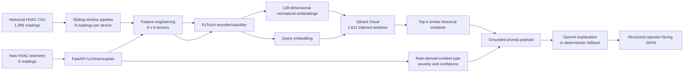

# HavenIQ HVAC RAG System: Codebase Overview

## Purpose

HavenIQ HVAC RAG is an end-to-end retrieval-augmented generation (RAG) system for explaining HVAC telemetry anomalies.

The system accepts a short sequence of live HVAC readings, detects the type and severity of the current pattern, retrieves similar historical telemetry incidents from a vector database, and generates a structured explanation for an operator. The goal is to turn raw sensor data into actionable context: what is happening, why it may matter, which historical patterns resemble it, and what an operator should check next.

This document is intended to provide enough context to describe the project accurately in a portfolio website, project page, resume, or technical discussion.

## Portfolio Summary

Built a containerized FastAPI RAG service that explains HVAC anomalies using a custom PyTorch telemetry encoder, Qdrant Cloud vector retrieval, and optional OpenAI-generated operator guidance. The data pipeline transformed 1,996 raw sensor readings into 1,611 searchable historical windows. At runtime, the API embeds each new 8-reading window into a 128-dimensional vector, retrieves the closest historical incidents using cosine similarity, and returns a structured JSON explanation with risk factors and recommended checks.

## Verified Project Metrics

| Metric | Value |
| --- | --- |
| Raw historical telemetry readings | 1,996 |
| Searchable historical telemetry windows | 1,611 |
| Readings per telemetry window | 8 |
| Engineered features per reading | 8 |
| Input tensor shape | `[8, 8]` |
| Flattened encoder input size | 64 |
| Embedding dimensions | 128 |
| Qdrant distance metric | Cosine similarity |
| Default retrieved historical matches | 5 |
| Supported incident classes | 5 |
| Trained model artifact size | 171,829 bytes |
| Current unit tests | 5 |

## High-Level Architecture



## Core Runtime Flow

The main runtime endpoint is:

```text
POST /v1/hvac/explain
```

The endpoint receives exactly 8 readings from the same HVAC device. It then:

1. Validates that the request contains an 8-reading single-device window.
2. Engineers an `[8, 8]` feature matrix.
3. Summarizes the telemetry window using temperature, humidity, setpoint-error, confidence, and slope statistics.
4. Derives an incident type and severity.
5. Uses the packaged PyTorch encoder to produce a normalized 128-dimensional vector.
6. Searches the Qdrant collection for the most similar historical vectors.
7. Builds a grounded prompt containing the current incident and retrieved historical evidence.
8. Uses OpenAI to generate structured operator guidance when `OPENAI_API_KEY` is configured.
9. Falls back to a deterministic local explanation when OpenAI is not configured.

The output includes:

- incident type
- severity
- confidence score
- similar historical telemetry windows
- operator summary
- why the pattern is risky
- contextual factors
- recommended next checks
- evidence strength
- limitations

## Historical Data Pipeline

The first historical corpus is loaded from:

```text
C:\Users\matth\Desktop\programming projects\HavenIQ Hvac Model\data\raw\haveniq_hvac_test.csv
```

The CSV contains:

```text
device_id
timestamp_utc
temp_c
setpoint_c
humidity_pct
confidence_score
```

The historical preprocessing pipeline:

```text
1,996 raw telemetry readings
-> group by HVAC device
-> sort each device's readings chronologically
-> create overlapping 8-reading windows with stride 1
-> engineer 8 features per reading
-> calculate summary metadata
-> assign incident type and severity
-> save 1,611 historical windows
```

The generated historical windows are stored locally in:

```text
artifacts/hvac_windows.jsonl
```

This JSONL artifact is used to train the encoder and backfill Qdrant. It is not required by the deployed runtime API after the historical vectors have been uploaded.

## Feature Engineering

Each HVAC reading is transformed into 8 values:

| Feature | Meaning |
| --- | --- |
| `temp_c` | Current measured temperature |
| `setpoint_c` | Desired temperature |
| `humidity_pct` | Current humidity percentage |
| `temp_minus_setpoint` | Temperature error relative to target |
| `temp_delta` | Temperature change since previous reading |
| `setpoint_delta` | Setpoint change since previous reading |
| `humidity_delta` | Humidity change since previous reading |
| `abs_temp_error` | Absolute temperature error |

Because each window contains 8 readings and each reading contains 8 engineered features, the model receives an `[8, 8]` tensor with 64 total input values.

The window metadata also includes:

```text
temp_start_c
temp_end_c
temp_min_c
temp_max_c
temp_slope_c
setpoint_avg_c
temp_error_avg_c
temp_error_max_c
humidity_avg_pct
humidity_max_pct
confidence_score_avg
confidence_score_max
window_start
window_end
device_id
```

## Incident Classification Rules

The current scaffold derives incident classes with deterministic operational rules before generating an explanation.

Supported incident classes:

| Incident type | Trigger |
| --- | --- |
| `freeze_risk` | Minimum temperature is at most `5C`, or ending temperature is at most `7C` |
| `hvac_drift` | Average setpoint error is at least `2.5C`, or maximum setpoint error is at least `4.0C` |
| `humidity_risk` | Maximum humidity is at least `70%` |
| `normal` | Low confidence, low setpoint error, and humidity below `65%` |
| `hvac_anomaly` | Catch-all anomaly class when no earlier rule matches |

Severity is derived separately:

| Severity | Trigger |
| --- | --- |
| `critical` | Average confidence is at least `85`, or minimum temperature is at most `3C` |
| `high` | Average confidence is at least `70` |
| `medium` | Average confidence is at least `40` |
| `low` | Any lower score |

The LLM does not override these results. It is instructed to explain the model-owned incident type, confidence, and severity using only the supplied telemetry and retrieved historical evidence.

## PyTorch Encoder

The model is a lightweight multilayer perceptron implemented in `app/encoder.py`.

Architecture:

```text
8 x 8 telemetry feature matrix
-> flatten to 64 values
-> Linear(64, 128)
-> ReLU
-> Linear(128, 128)
-> ReLU
-> Linear(128, 128)
-> 128-dimensional embedding
-> Linear(128, 5)
-> incident-class logits
```

The training workflow uses:

```text
optimizer: Adam
learning rate: 1e-3
loss function: cross-entropy
default epochs: 60
```

The trained weights are saved with:

```python
torch.save(model.state_dict(), model_path)
```

The deployed runtime loads the weights on CPU and normalizes generated vectors before sending them to Qdrant.

Packaged deployment artifacts:

```text
artifacts/hvac_encoder_mlp_v1.pt
artifacts/label_map.json
```

The encoder also includes a deterministic SHA-256-based fallback embedding function. This dependency-free path supports tests and local fallback scenarios when a model file is absent.

## Qdrant Vector Retrieval

The vector database collection is:

```text
haveniq_hvac_windows
```

Collection configuration:

```text
vector dimensions: 128
distance metric: cosine similarity
```

Each Qdrant point stores:

```text
point ID: deterministic UUID for the telemetry window
vector: normalized 128-dimensional encoder output
payload: incident metadata and telemetry summary
```

Payload fields include:

```text
window_id
device_id
incident_type
severity
confidence_score
window_start
window_end
feature_schema_version
encoder_version
summary_text
temperature summary statistics
humidity summary statistics
setpoint-error statistics
```

Every search filters on:

```text
encoder_version == "hvac_encoder_mlp_v1"
feature_schema_version == "hvac_features_v1"
```

For high-confidence windows, searches can additionally filter on:

```text
incident_type == current incident type
```

The code creates keyword payload indexes for:

```text
encoder_version
feature_schema_version
incident_type
```

This keeps filtered retrieval compatible with Qdrant Cloud and avoids comparing incompatible vectors across future schema or model versions.

## LLM Grounding Strategy

The OpenAI integration is intentionally constrained. The LLM is responsible for explanation, not anomaly classification.

The prompt contains:

```text
current device ID
window timestamps
predicted incident type
confidence score
severity
telemetry summary metadata
current-window summary text
retrieved historical incident summaries
retrieval similarity scores
```

The system prompt instructs the LLM to:

```text
use only the supplied current telemetry and retrieved incidents
avoid inventing telemetry
avoid overriding model-owned severity, confidence, or incident type
return concise structured JSON
```

Expected explanation keys:

```text
operator_summary
why_this_is_risky
similar_historical_patterns
contextual_factors
recommended_next_checks
evidence_strength
limitations
```

If `OPENAI_API_KEY` is absent, the service returns a deterministic local explanation with the same general operator-facing purpose.

## FastAPI Endpoints

| Method | Endpoint | Purpose |
| --- | --- | --- |
| `GET` | `/health` | Reports artifact presence and configuration versions |
| `POST` | `/v1/hvac/windows/build` | Converts historical CSV telemetry into 8-reading windows |
| `POST` | `/v1/hvac/train-encoder` | Trains and saves the PyTorch encoder |
| `POST` | `/v1/hvac/backfill-qdrant` | Embeds historical windows and uploads them to Qdrant |
| `POST` | `/v1/hvac/retrieve` | Returns prediction plus similar historical windows |
| `POST` | `/v1/hvac/explain` | Main runtime endpoint: retrieval plus operator explanation |
| `POST` | `/v1/embed` | Debug endpoint that returns the raw 128-dimensional embedding |

The interactive OpenAPI/Swagger form is available at:

```text
/docs
```

The complete endpoint guide is stored in:

```text
API_ENDPOINTS_GUIDE.md
```

## Example Runtime Request

The runtime endpoints expect exactly 8 readings from one device:

```json
{
  "readings": [
    {
      "device_id": "dev_hvac_demo_001",
      "timestamp_utc": "2026-05-26T12:00:00Z",
      "temp_c": 22.4,
      "setpoint_c": 22.0,
      "humidity_pct": 47.2,
      "confidence_score": 28.0
    }
  ],
  "top_k": 5,
  "filter_incident_type": true
}
```

The displayed array is abbreviated for readability. A real request must include all 8 readings.

## Environment Configuration

The application loads `.env` locally through `python-dotenv`.

Qdrant Cloud:

```env
QDRANT_URL=https://your-qdrant-endpoint
QDRANT_API_KEY=your_qdrant_api_key
QDRANT_COLLECTION=haveniq_hvac_windows
```

Optional OpenAI explanation generation:

```env
OPENAI_API_KEY=your_openai_api_key
OPENAI_MODEL=gpt-4.1-mini
```

Artifact location override:

```env
HAVENIQ_ARTIFACT_DIR=/app/artifacts
```

Historical CSV override:

```env
HAVENIQ_HVAC_CSV=/path/to/haveniq_hvac_test.csv
```

Secrets are not committed. The `.env` file is excluded by `.gitignore`.

## Containerization and Deployment

The FastAPI service is containerized with Docker using `python:3.12-slim`.

Docker build flow:

```text
copy requirements.txt
-> install Python dependencies
-> copy application modules and scripts
-> copy trained model weights and label map
-> start Uvicorn on port 8000
```

The image intentionally includes:

```text
artifacts/hvac_encoder_mlp_v1.pt
artifacts/label_map.json
```

The image does not need to include the large historical `hvac_windows.jsonl` artifact for normal runtime retrieval because those vectors already live in Qdrant Cloud.

The API is designed to deploy as a Render Web Service or another Docker-compatible container host. The deployment host must provide environment variables for Qdrant and, optionally, OpenAI.

The repository also contains `docker-compose.yml` for local development. It can start:

```text
FastAPI API
Qdrant
PostgreSQL 16
```

The production Qdrant path uses Qdrant Cloud rather than requiring the local Qdrant container.

## PostgreSQL Schema

The repository includes a future-facing PostgreSQL schema in:

```text
schemas/postgres.sql
```

The planned relational tables are:

```text
telemetry_windows
incident_records
telemetry_embeddings
rag_explanations
```

These tables are designed for durable incident records, model-version tracking, and explanation audit history.

Important: PostgreSQL persistence is scaffolded but is not currently wired into the FastAPI runtime. Current retrieval persistence is handled by Qdrant.

## Repository Structure

```text
HavenIQ RAG system/
|-- app/
|   |-- __init__.py
|   |-- config.py              Environment variables, paths, and version settings
|   |-- encoder.py             PyTorch model, training, and embedding generation
|   |-- explainer.py           OpenAI prompt construction and local fallback explanation
|   |-- hvac_features.py       CSV loading, windowing, features, labels, and summaries
|   |-- main.py                FastAPI application and HTTP endpoints
|   `-- retrieval.py           Qdrant collection setup, payload indexes, backfill, and search
|-- scripts/
|   |-- build_windows.py       Generate historical telemetry windows
|   |-- train_encoder.py       Train and save the encoder
|   `-- backfill_qdrant.py     Upload historical embeddings to Qdrant
|-- artifacts/
|   |-- hvac_encoder_mlp_v1.pt Saved encoder weights
|   |-- label_map.json         Incident-label mapping
|   `-- hvac_windows.jsonl     Local generated historical windows
|-- schemas/
|   `-- postgres.sql           Future durable relational storage schema
|-- tests/
|   `-- test_hvac_features.py  Unit tests for features, rules, and fallback embeddings
|-- API_ENDPOINTS_GUIDE.md     Detailed API usage guide
|-- Dockerfile                 Container image definition
|-- docker-compose.yml         Local API, Qdrant, and PostgreSQL services
|-- requirements.txt           Python dependencies
`-- README.md                  Quick-start documentation
```

## Setup Commands

Create the telemetry windows:

```powershell
.\.venv\Scripts\python.exe -m scripts.build_windows
```

Train and save the encoder:

```powershell
.\.venv\Scripts\python.exe -m scripts.train_encoder
```

Backfill Qdrant:

```powershell
.\.venv\Scripts\python.exe -m scripts.backfill_qdrant
```

Run the API locally:

```powershell
.\.venv\Scripts\python.exe -m uvicorn app.main:app --host 127.0.0.1 --port 8000
```

Run tests:

```powershell
.\.venv\Scripts\python.exe -m pytest
```

## Test Coverage

The current test suite verifies:

```text
CSV loading and expected numeric parsing
8-reading window shape
8 engineered features per reading
freeze-risk precedence
normal-state classification
deterministic 128-dimensional fallback embeddings
```

Current test count:

```text
5 tests
```

## Current Scope and Limitations

This project is a working RAG scaffold and deployable MVP, not a fully hardened production platform.

Implemented:

- historical telemetry preprocessing
- custom PyTorch embedding model
- trained and packaged model artifact
- Qdrant Cloud backfill
- vector similarity retrieval with cosine distance
- metadata payload indexing and filtering
- OpenAI-grounded structured explanations
- deterministic local explanation fallback
- FastAPI endpoints and Swagger documentation
- Docker container packaging
- local Docker Compose stack
- initial unit tests

Not yet implemented:

- automatic ingestion from live IoT telemetry streams
- authentication and API authorization
- rate limiting
- durable runtime audit persistence in PostgreSQL
- retries and exponential backoff for Qdrant and OpenAI failures
- production monitoring, metrics, and alerting
- model-registry-based deployment and rollback
- broad integration and load testing
- strict validation for timestamp ordering, duplicates, and missing intervals

The current corpus is synthetic/test HVAC telemetry. The explanation layer explicitly reports that weather, occupancy, and leak data are not included in v1.

## Portfolio Talking Points

Short description:

> Built a containerized HVAC RAG API that converts live sensor windows into 128-dimensional embeddings, retrieves similar historical incidents from Qdrant Cloud, and uses an LLM to return grounded operator recommendations.

Data-engineering-focused description:

> Developed a Python telemetry pipeline that transformed 1,996 raw HVAC readings into 1,611 structured, searchable event windows and automated feature engineering, model training, vector indexing, and cloud backfill workflows.

RAG-focused description:

> Implemented retrieval-augmented generation over numeric sensor data by training a custom PyTorch encoder, indexing historical telemetry in Qdrant Cloud, retrieving nearest incidents with cosine similarity, and grounding LLM explanations in current and historical evidence.

Deployment-focused description:

> Containerized the FastAPI RAG service with Docker, packaged trained model artifacts for runtime inference, and configured environment-based Qdrant Cloud and OpenAI integrations for deployment on Render.

## Suggested Resume Bullets

- Built a FastAPI RAG service that explains HVAC sensor anomalies using retrieved historical incidents and LLM-generated operator recommendations.
- Processed 1,996 telemetry readings into 1,611 searchable event windows and indexed 128-dimensional embeddings in Qdrant Cloud.
- Trained a custom PyTorch encoder and retrieved nearest telemetry incidents using cosine similarity with metadata filtering.
- Containerized the API with Docker and packaged trained model artifacts for deployment on Render.

## Technologies

```text
Python
FastAPI
Pydantic
PyTorch
NumPy
Qdrant Cloud
OpenAI API
Docker
Docker Compose
PostgreSQL schema design
Pytest
Render-compatible deployment
```

