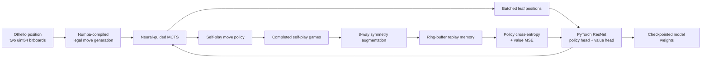

# AlphaZero-Style Othello Engine: Codebase Overview

## Purpose

This project is a self-play reinforcement-learning engine for Othello. It uses
an AlphaZero-style architecture: a residual neural network evaluates board
positions, Monte Carlo Tree Search (MCTS) converts those evaluations into
stronger move policies, and completed self-play games become training data for
the next model update.

The implementation is built around the performance constraints of game-tree
search. Othello boards are represented as two 64-bit integers, core move logic
is JIT-compiled with Numba, and MCTS leaf evaluations are grouped into batched
GPU forward passes. The training pipeline also parallelizes self-play across
worker processes and saves checkpoints for long-running experiments.

This document is intended to provide enough context to describe the project
accurately in a portfolio website, project page, resume, or technical
discussion.

## Portfolio Summary

Built an AlphaZero-style Othello engine in Python that learns from self-play
using a PyTorch residual network and neural-guided Monte Carlo Tree Search. The
engine uses compact `uint64` bitboards and Numba-compiled move generation,
batches MCTS leaf evaluations for efficient GPU inference, augments self-play
positions with all 8 board symmetries, trains from a ring-buffer replay memory,
and checkpoints long-running CUDA experiments for later evaluation.

## Short Project Card Copy

**AlphaZero-Style Othello Engine**

Self-play reinforcement-learning engine for Othello. Built a bitboard game
core, neural-guided Monte Carlo Tree Search, and a PyTorch ResNet training
pipeline with batched GPU inference, multiprocessing workers, symmetry-based
data augmentation, and checkpoint evaluation tools.

**Stack:** Python, PyTorch, NumPy, Numba, CUDA, multiprocessing, Matplotlib

## Resume Bullet

Built an AlphaZero-style Othello engine with a 2.97-million-parameter PyTorch
ResNet, neural-guided MCTS, Numba-compiled `uint64` bitboards, batched GPU
inference, multiprocessing self-play workers, 8-way symmetry augmentation, and
checkpoint-based model evaluation.

## Verified Project Metrics

| Metric | Value |
| --- | --- |
| Board size | `8 x 8` |
| Board representation | Two `uint64` bitboards |
| Neural-network input | `(batch, 3, 8, 8)` |
| Residual blocks | `10` |
| Trunk filters | `128` |
| Trainable model parameters | `2,970,823` |
| Policy output | `64` move probabilities |
| Value output | One scalar in `[-1, 1]` |
| Self-play symmetry augmentation | `8x` per retained position |
| Replay-buffer capacity | About `384,000` positions |
| Configured MCTS search range | `150` to `500` simulations per move |
| Configured self-play game range | `75` to `200` games per iteration |
| Multiprocessing workers | `4` |
| Training batch size | `2,048` |
| Checkpoint interval | Every `5` iterations |

The replay-buffer capacity is calculated from `800` configured games, about
`60` positions per game, and `8` board symmetries:

```text
800 * 60 * 8 = 384,000 positions
```

## High-Level Architecture



## Core Training Loop

The training pipeline is defined in `othello/train.py`.

Each training iteration performs:

1. **Phase scaling** - linearly increases MCTS search depth and the number of
   self-play games as training progresses.
2. **Self-play** - reconstructs the current model inside worker processes and
   plays multiple games in parallel.
3. **Data augmentation** - rotates and mirrors retained positions to generate
   all 8 square-board symmetries.
4. **Replay-buffer updates** - writes `(board, policy, value)` samples into a
   fixed-size NumPy ring buffer.
5. **Optimization** - samples random mini-batches and minimizes policy
   cross-entropy plus value mean-squared error.
6. **Checkpointing** - writes model weights every 5 iterations and appends
   losses to CSV.

The current script is configured for a resumed experiment: its loop starts at
iteration `300`, and it includes a `RESUME_CHECKPOINT` path for loading earlier
weights.

## Self-Play Data Generation

Each worker creates a batch of Othello games and advances all active games
together. For every move:

```text
active games
-> batched MCTS search
-> selected moves and visit-count policies
-> board histories
-> final winner labels
-> symmetry augmentation
-> replay buffer
```

The recorded value target is:

```text
+1  if the player-to-move eventually wins
 0  if the game is drawn
-1  if the player-to-move eventually loses
```

Positions from the very beginning of a game are skipped to avoid overloading
the replay buffer with near-identical openings. Every retained sample is
expanded into 4 rotations and 2 mirrored variants.

## Neural-Guided MCTS

The search implementation lives in `othello/BetaFish.py`.

Each node stores:

- the black and white bitboards
- the current player
- the move that produced the node
- its neural-network prior probability
- accumulated value and visit count
- child nodes and remaining expandable moves

MCTS repeatedly performs:

1. **Selection** - walk down the tree using a PUCT score that balances expected
   value and neural-network prior probability.
2. **Expansion** - evaluate queued leaf positions with the ResNet and create
   legal child nodes.
3. **Backpropagation** - propagate values toward the root while flipping the
   sign at each level because the player perspective changes.
4. **Move selection** - sample from visit counts early in self-play and switch
   to greedy play after move `20`.

The PUCT formula implemented by the search tree is:

```text
score =
    -(child_value_sum / child_visit_count)
    + exploration_constant
      * child_prior
      * sqrt(parent_visit_count)
      / (1 + child_visit_count)
```

The configured exploration constant is `1.5`. Self-play also adds Dirichlet
noise at the root with alpha `0.3` and epsilon `0.25`, encouraging the engine
to explore moves beyond its current policy preference.

## Batched GPU Inference

The most important search optimization is `MCTS.search_batch()`.

Instead of evaluating one leaf position at a time, the search:

1. walks the trees for all active games
2. collects the leaf nodes that need expansion
3. converts those positions into one tensor
4. runs a shared neural-network forward pass
5. attaches legal children using the returned policies
6. backpropagates the returned values

This makes self-play better suited to GPU hardware, where a batch of board
positions is more efficient than a stream of individual inference calls.

## ResNet Architecture

The network is defined in `othello/model.py`.

### Input Encoding

Each board becomes three `8 x 8` planes:

| Plane | Meaning |
| --- | --- |
| `0` | Current player's pieces |
| `1` | Opponent's pieces |
| `2` | Turn indicator: all ones for black, all zeroes for white |

### Model Structure

```text
(batch, 3, 8, 8)
-> 3x3 convolution, batch normalization, ReLU
-> 10 residual blocks with 128 filters
-> policy head: 64 move probabilities
-> value head: scalar in [-1, 1]
```

The policy head predicts which squares are promising. The value head estimates
whether the current player is likely to win from the position.

## Bitboard Game Engine

The low-level Othello engine lives in `othello/board.py`.

The board is stored as:

```text
black_bb: uint64
white_bb: uint64
```

Bit index `i` maps to:

```text
row = i // 8
col = i % 8
```

Legal move generation scans all 8 directions using bit shifts and edge masks.
Move application scans outward from the selected square, finds bracketed
opponent pieces, flips the captured lines, and returns updated bitboards.

The hot functions are decorated with Numba `@njit`, including:

- least-significant-bit extraction
- bit population count
- legal move generation
- move application
- terminal-state detection
- value calculation

`othello/game.py` wraps these functions in a higher-level `Game` class with
legal-move validation, pass-turn handling, winner detection, and terminal
board display.

## Replay Buffer and Optimization

`ReplayBuffer` preallocates NumPy arrays for:

```text
boards:   (max_positions, 3, 8, 8)
policies: (max_positions, 64)
values:   (max_positions,)
```

It behaves as a ring buffer: once full, new self-play positions overwrite the
oldest samples. This limits memory usage while keeping training focused on
recent model behavior.

The training loss is:

```text
total_loss = policy_loss + value_loss

policy_loss = cross-entropy(MCTS visit policy, predicted policy)
value_loss  = MSE(game outcome, predicted value)
```

The optimization loop uses Adam, gradient clipping, automatic mixed precision,
and CUDA transfers with non-blocking copies.

## Evaluation Tools

The repository contains checkpoint comparison utilities:

- `tests/bot_vs_bot.py` runs two checkpoints against each other across both
  colors with randomized opening moves.
- `tests/test_game.py` runs a human-versus-bot terminal session using a selected
  checkpoint.
- `plot_loss.py` reads checkpoint CSV logs and saves smoothed policy, value,
  and total-loss curves.

The training module also contains a new-model-versus-best-model evaluation
function with a `52%` promotion threshold. The call site is currently commented
out while the resumed training experiment runs.

## Repository Layout

```text
.
|-- othello/
|   |-- board.py        # Numba-compiled bitboard operations
|   |-- game.py         # High-level Othello game wrapper
|   |-- model.py        # PyTorch ResNet and board encoding
|   |-- BetaFish.py     # MCTS node and batched search implementation
|   `-- train.py        # Self-play, replay buffer, training, evaluation
|-- tests/
|   |-- bot_vs_bot.py   # Checkpoint-vs-checkpoint evaluation script
|   `-- test_game.py    # Human-vs-bot terminal runner
|-- modal_jobs/
|   `-- train_modal.py  # Placeholder for cloud training work
|-- plot_loss.py        # Training-loss visualization
|-- requirements.txt
`-- README.md
```

## Local Usage

Install dependencies:

```bash
pip install -r requirements.txt
```

Start the configured CUDA training run:

```bash
python -m othello.train
```

Plot loss curves from a training run:

```bash
python plot_loss.py checkpoints/<run>/loss_log.csv
```

Compare two selected checkpoints:

```bash
python tests/bot_vs_bot.py
```

Training requires a CUDA-capable GPU because `othello/train.py` currently sets:

```python
device = "cuda"
```

## Current Scope and Limitations

- The repository does not currently contain a web interface or playable GUI.
  Interaction and checkpoint evaluation run through terminal scripts.
- The files under `tests/` are interactive or long-running evaluation scripts,
  not isolated automated unit tests. Running `pytest` currently does not
  complete as a fast test suite.
- Automated model promotion is implemented but currently disabled at the
  training-loop call site.
- `modal_jobs/train_modal.py` is a placeholder; distributed cloud training is
  not yet implemented there.
- Self-play worker allocation uses integer division, so configured game counts
  should be divisible by the worker count to avoid dropping remainder games.
- CUDA training is hardcoded in the main training entry point.

## Technical Talking Points

- Used bitboards to represent an Othello board in two machine words, making move
  generation and piece flipping compact and efficient.
- JIT-compiled hot board operations with Numba while keeping orchestration and
  model code in readable Python.
- Batches MCTS leaf evaluations across active games to improve GPU utilization.
- Uses residual learning with separate policy and value heads, following the
  core AlphaZero design pattern.
- Generates training labels entirely from self-play rather than a human game
  dataset.
- Applies all 8 square-board symmetries to increase sample diversity without
  changing game semantics.
- Uses multiprocessing workers, mixed precision, gradient clipping, replay
  buffering, checkpointing, and CSV loss logging for long-running experiments.

## Suggested Website Copy

**AlphaZero-Style Othello Engine**

I built a self-play reinforcement-learning engine for Othello using PyTorch,
Numba, and CUDA. The engine stores boards as two 64-bit bitboards, uses
Numba-compiled move generation, and combines a 10-block ResNet with
neural-guided Monte Carlo Tree Search. To make training practical, it batches
MCTS leaf evaluations on the GPU, parallelizes self-play across worker
processes, augments positions with all 8 board symmetries, and saves checkpoints
for model comparison and loss analysis.
