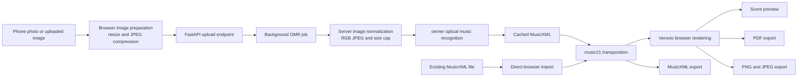

# ScoreShift: Codebase Overview

## Purpose

ScoreShift is a deployed web application for transposing printed sheet music.
Users can upload or photograph a page of sheet music, run optical music
recognition (OMR), transpose the recognized score by semitones or into a target
key, preview the result in the browser, and download the transposed score.

The application also supports direct MusicXML imports. This provides a faster
path for users who already have a digital score and do not need image
recognition.

This document is intended to provide enough context to describe the project
accurately in a portfolio website, project page, resume, or technical
discussion.

## Live Deployment

| Resource | URL |
| --- | --- |
| Public Hugging Face Spaces page | [https://huggingface.co/spaces/Mahu454/scoreshift](https://huggingface.co/spaces/Mahu454/scoreshift) |
| Direct hosted web app | [https://mahu454-scoreshift.hf.space](https://mahu454-scoreshift.hf.space) |

The application is deployed as a public Docker-based Hugging Face Space on the
free CPU tier.

## Portfolio Summary

Built and deployed ScoreShift, a containerized FastAPI web application that
converts uploaded sheet-music images into transposable digital scores. The
pipeline uses `oemer` for optical music recognition, `music21` for MusicXML
transposition, and browser-side Verovio rendering for score previews and
downloads. The app supports semitone and target-key transposition, direct
MusicXML imports, mobile photo uploads, browser-side PDF/PNG/JPEG export, and
Docker deployment to Hugging Face Spaces.

## Short Project Card Copy

**ScoreShift** is a web app for transposing sheet music from a photo or MusicXML
file. It uses optical music recognition to convert printed notation into a
digital score, supports semitone and target-key transposition, renders the
result in the browser, and exports PDF, PNG, JPEG, or MusicXML files.

**Tech:** Python, FastAPI, JavaScript, Docker, `oemer`, `music21`, Verovio,
Hugging Face Spaces.

## Resume Bullet

Built and deployed a Dockerized FastAPI sheet-music transposition app that
converts uploaded images into MusicXML with optical music recognition,
transposes scores using `music21`, and exports browser-rendered PDF, PNG, JPEG,
and MusicXML files through a mobile-friendly web interface.

## High-Level Architecture



## Core User Flow

### Image Upload Path

```text
choose image or phone photo
-> browser prepares large images for upload
-> FastAPI streams upload to temporary storage
-> background OMR job normalizes image for recognition
-> oemer converts printed notation into MusicXML
-> frontend polls until MusicXML is ready
-> Verovio renders the score preview
-> user transposes and downloads the result
```

### MusicXML Import Path

```text
import .xml or .musicxml file
-> skip OMR
-> render score immediately
-> transpose with music21
-> download PDF, PNG, JPEG, or MusicXML
```

The MusicXML path is much faster because it skips the CPU-heavy OMR step.

## Main Features

- Upload printed Western sheet music as PNG, JPEG, BMP, TIFF, or WebP images.
- Take or select a photo from a mobile device's native file chooser.
- Import existing `.xml` or `.musicxml` files directly.
- Transpose by a configurable number of semitones.
- Transpose into a selected major or minor target key.
- Preview the rendered score in the browser.
- Download a directly generated `transposed.pdf`.
- Download clean PNG or JPEG files, one file per rendered score page.
- Download the transposed MusicXML source.
- Cache recognized MusicXML by image hash to avoid repeated OMR work.

## Runtime Stack

| Layer | Technology | Responsibility |
| --- | --- | --- |
| Backend API | FastAPI and Uvicorn | Serves the frontend, accepts uploads, tracks jobs, transposes MusicXML, and returns MusicXML downloads |
| Frontend | Plain HTML, CSS, and JavaScript | Handles uploads, polling, controls, score previews, and browser-side exports |
| Optical music recognition | `oemer` | Converts printed sheet-music images into MusicXML |
| Music processing | `music21` | Parses MusicXML and transposes notes, chords, and key signatures |
| Score rendering | Verovio WASM | Renders MusicXML as SVG notation in the browser |
| PDF export | `jsPDF` and `svg2pdf.js` | Converts clean Verovio SVG pages into a directly downloaded PDF |
| PNG/JPEG export | Browser Canvas API | Converts clean Verovio SVG pages into raster downloads |
| Deployment | Docker and Hugging Face Spaces | Runs the full app on a public free-tier container |

## Backend API

### `POST /api/upload`

Accepts one multipart image upload named `image`.

The endpoint:

1. Checks the file extension.
2. Streams the file to temporary storage.
3. Enforces the `MAX_UPLOAD_MB` limit.
4. Starts an in-process asynchronous OMR job.
5. Returns a generated `job_id`.

### `GET /api/jobs/{job_id}`

Returns the current OMR job state:

```text
queued
running
done
error
```

When processing is complete, the response includes the generated MusicXML text.
The browser polls this endpoint every two seconds.

### `POST /api/transpose`

Accepts the current MusicXML, a mode, and a value:

```json
{
  "musicxml": "<score-partwise>...</score-partwise>",
  "mode": "semitones",
  "value": 2
}
```

or:

```json
{
  "musicxml": "<score-partwise>...</score-partwise>",
  "mode": "key",
  "value": "Bb"
}
```

### `POST /api/export`

Returns a MusicXML download. PDF, PNG, and JPEG exports remain browser-side so
they work consistently without depending on server-native rendering libraries.

## Image And OMR Handling

Large phone photos require extra handling because modern camera images can be
larger than 10 MB and can slow down recognition.

ScoreShift uses two preparation steps:

1. Browser-side preparation resizes large images to a maximum side length of
   `2200px` and converts them to JPEG before upload.
2. Server-side preparation converts uploads to RGB JPEG and limits the OMR
   input to a maximum side length of `1800px`.

The backend currently allows uploads up to `30 MB`. OMR runs have a
`600`-second timeout so a stuck recognition process fails with a clear message
instead of polling forever.

The OMR cache key is a SHA-256 hash of the normalized image bytes:

```text
cache/<sha256>.musicxml
```

## Browser Export Pipeline

The rendered score can include Verovio artifact SVGs alongside valid score
pages. ScoreShift filters those artifacts before exporting.

A valid export page must:

- have normal `width` and `height` attributes
- stay within expected page dimensions
- avoid giant artifact `viewBox` dimensions
- contain visible notation graphics

Exports then behave as follows:

| Format | Behavior |
| --- | --- |
| PDF | Generates and directly downloads `transposed.pdf` using vector SVG rendering |
| PNG | Downloads one clean file per valid page, such as `transposed-1.png` |
| JPEG | Downloads one clean file per valid page, such as `transposed-1.jpg` |
| MusicXML | Downloads `transposed.musicxml` from the backend |

## Deployment

ScoreShift is configured as a Docker-based Hugging Face Space.

The Docker container:

- uses Python `3.11-slim`
- installs native libraries required by the Python dependencies
- installs `requirements-full.txt`
- runs as a non-root Linux user
- exposes port `7860`
- starts Uvicorn with `app.main:app`

The included deployment helper creates or updates the public Space:

```powershell
.\.venv\Scripts\python.exe scripts\deploy_hf_space.py
```

The public deployment stays at:

```text
https://huggingface.co/spaces/Mahu454/scoreshift
```

## Local Development

```powershell
cd "C:\Users\matth\Desktop\programming projects\music-transposer"
python -m venv .venv
.\.venv\Scripts\Activate.ps1
pip install -r requirements-dev.txt
copy .env.example .env
uvicorn app.main:app --reload
```

Then open:

```text
http://localhost:8000
```

Run tests:

```powershell
.\.venv\Scripts\python.exe -m pytest -q
```

## Configuration

```text
HOST=0.0.0.0
PORT=8000 or 7860
MAX_UPLOAD_MB=30
MAX_OMR_IMAGE_SIDE=1800
OMR_TIMEOUT_SECONDS=600
CACHE_DIR=./cache or /data/cache
TMP_DIR=./tmp or /data/tmp
```

## Current Automated Tests

The repository contains smoke/regression tests for:

- serving the ScoreShift frontend
- transposing MusicXML by semitones
- returning valid MusicXML downloads
- completing an upload and background-job flow with OMR mocked out

Real OMR is intentionally excluded from routine tests because it is
model-heavy, slow, and dependent on external model files.

## Known Limitations

- OMR is CPU-heavy and can take several minutes on a free Hugging Face Space.
- The first OMR request can be slower while model files download or load.
- OMR is intended for printed Western notation, not handwritten scores.
- Recognition quality depends on image clarity, cropping, shadows, and score
  complexity.
- Job state is stored in memory and disappears when the container restarts.
- The local cache is container-local unless persistent storage is attached.
- The free Hugging Face deployment is appropriate for demos and light personal
  use, not high-concurrency production traffic.
- Browser rendering depends on external CDN-hosted Verovio JavaScript.

## Strong Next Improvements

1. Replace in-memory job state with Redis-backed queue storage.
2. Move OMR work into a dedicated worker process.
3. Add a queue position and staged progress bar to the frontend.
4. Persist cached MusicXML files with object storage or an attached volume.
5. Add rate limiting for public deployments.
6. Add integration tests with representative sheet-music images.

